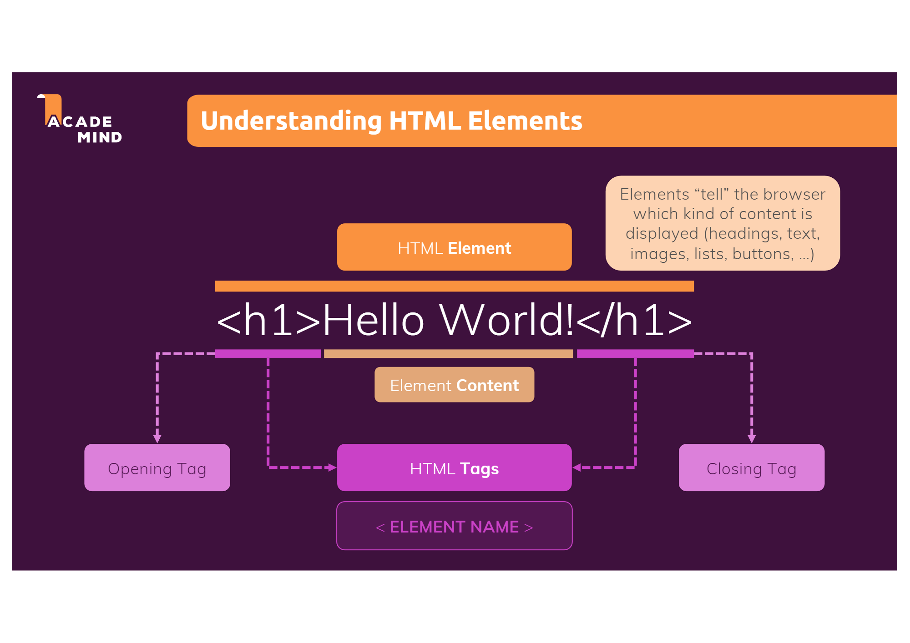
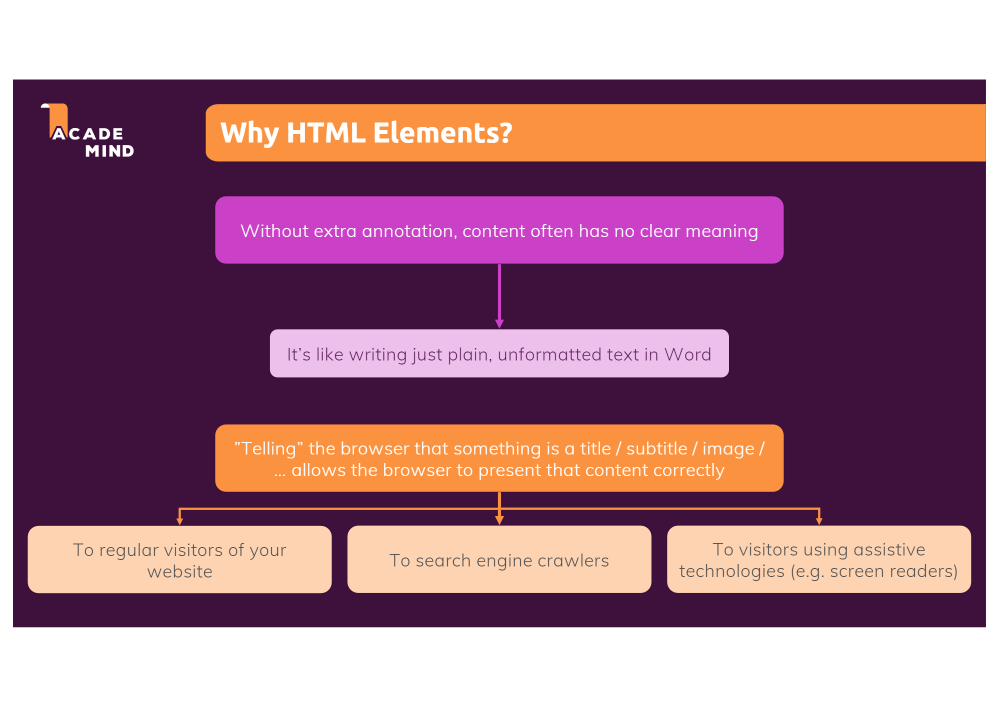

# Day2 - Create Web Page

## Setting Development Environment

### Download IDE (Integrated Development Environment, Code Editor)

Web Development - common use : VSCode(Visual Studio Code) **Not Visual Studio**

Why using IDE

- Easy to edit : grammar, syntax friendly
- etc

Why VSCode

- grammar, tags... Extra Information
- Automatically Complete Code -> grammar friendly
- etc

---

## HTML - Hyper Text Markup Language

### Markup Language?

A language that is there to add extra annotation to content.

### Understanding HTML Element

### Which HTML Elements Exist?

- There are so many elements existed.
(Because there are a lot of things you can describe)

### Why HTML Elements?

